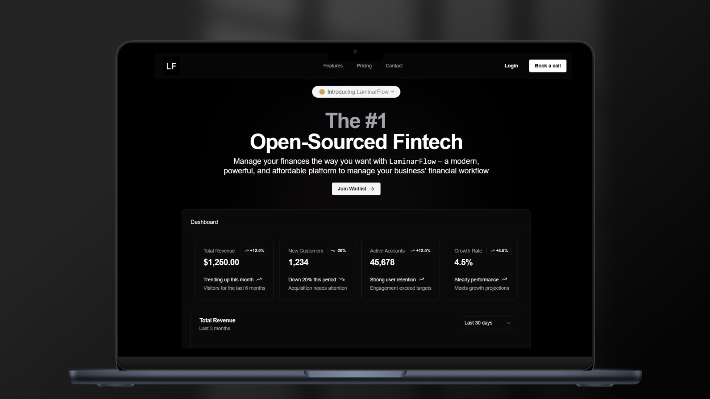

# LaminarFlow

**LaminarFlow is the open-source, AI-native finance platform for startups.** We are building the financial operating system for the next generation of companies, helping you automate financial operations, control spending, and accelerate growth—all with the trust and transparency of open-source.

Think of us as an AI-powered alternative to platforms like Mercury and Ramp, built for founders who want to move fast without losing control of their finances.

## ✨ Features

Our vision is to create a unified platform that serves as the command center for your company's finances.

- **AI Financial Copilot**: At the core of LaminarFlow is an autonomous agent workforce that automates your tedious financial tasks.
    - **Invoice Intelligence**: Automatically extract data from PDF invoices and record them.
    - **Smart Categorization**: AI-powered transaction categorization to eliminate manual data entry.
    - **Spend Anomaly Detection**: Proactively identify unusual spending patterns and potential savings.

<!-- 
- **Spend Management & Corporate Cards (Vision)**: Issue virtual and physical cards with built-in spend controls, automated expense reporting, and real-time tracking. Eliminate expense reports and close your books faster. -->

- **Smart Accounts Payable**: A full-cycle AP solution.
    - **Automated Bill Pay**: Pay bills via ACH, wire, or check.
    - **Approval Workflows**: Create custom approval chains to ensure every payment is authorized.
    - **Vendor Management**: A centralized dashboard for all your vendor information and payment history.

- **Accounts Receivable & Invoicing**:
    - **Professional Invoicing**: Create, customize, and send invoices in seconds.
    - **Automated Reminders**: Let our agents follow up on overdue invoices.
    - **Payment Integration**: Accept payments directly via Stripe.

- **Financial Command Center**: A real-time, interactive dashboard that provides a single source of truth for your company's financial health.
    - **Cash Flow Analytics**: Visualize and forecast your cash flow to make smarter decisions.
    - **Seamless Accounting Sync**: Integrate directly with QuickBooks, Xero, and other accounting software.

- **Open & Extensible**:
    - **Open-Source Core**: Our core platform is open-source, giving you unparalleled transparency and the ability to self-host.
    - **Developer API**: Access your financial data programmatically to build custom integrations and workflows.

## 🚀 Tech Stack

- **Framework**: [Next.js](https://nextjs.org/)
- **Language**: [TypeScript](https://www.typescriptlang.org/)
- **Styling**: [Tailwind CSS](https://tailwindcss.com/)
- **UI Components**: [shadcn/ui](https://ui.shadcn.com/), [Radix UI](https://www.radix-ui.com/), [Headless UI](https://headlessui.dev/)
- **Animations**: [Framer Motion](https://www.framer.com/motion/)
- **API**: [tRPC](https://trpc.io/), [Hono](https://hono.dev/)
- **Authentication**: [NextAuth.js](https://next-auth.js.org/)
- **ORM**: [Prisma](https://www.prisma.io/)
- **Database**: [PostgreSQL](https://www.postgresql.org/)
- **Schema Validation**: [Zod](https://zod.dev/)
- **File Uploads**: [UploadThing](https://uploadthing.com/)
- **Email**: [Resend](https://resend.com/), [Nodemailer](https://nodemailer.com/), [Mailtrap](https://mailtrap.io/)
- **AI**: [OpenAI](https://openai.com/), [Langbase](https://langbase.com/)
- **Payments/Monetization**: [Polar](https://polar.sh/), [Stripe](https://stripe.com/)
- **Analytics**: [Vercel Analytics](https://vercel.com/analytics)
- **Security**: [Arcjet](https://arcjet.com/)

## 🏛️ App Architecture

```
┌───────────────────────────┐
│        Frontend           │
│ (Next.js, React, tRPC)    │
└────────────┬──────────────┘
             │
┌────────────┴──────────────┐
│         API Layer         │
│ (Next.js API, tRPC, Hono) │
└────────────┬──────────────┘
             │
┌────────────┴──────────────┐
│      Database Layer       │
│(PostgreSQL, Prisma, Neon) │
└───────────────────────────┘
```

## 📂 Project Structure

```
d3-invoice/
├── app/
│   ├── (pages)/              # Marketing pages (blog, pricing, etc.)
│   ├── api/                  # API routes (Hono, NextAuth, UploadThing, etc.)
│   ├── dashboard/            # Core application dashboard routes
│   │   ├── agents/           # AI agent interfaces
│   │   ├── invoices/         # Invoice management pages
│   │   ├── safe/             # Secure file storage
│   │   └── ...               # Other dashboard sections
│   ├── layout.tsx            # Root layout
│   └── page.tsx              # Landing page
├── components/
│   ├── ui/                   # Core UI components from shadcn/ui
│   ├── dashboard/            # Components specific to the dashboard layout and pages
│   ├── chat/                 # Components for the AI chat interface
│   ├── home/                 # Components for the marketing landing page
│   └── ...
├── lib/
│   ├── utils.ts              # General utility functions
│   ├── invoiceAgent.ts       # Logic for the AI invoice agent
│   └── ...
├── prisma/
│   └── schema.prisma         # Database schema definition
├── public/                   # Static assets (images, fonts, etc.)
├── trpc/
│   ├── index.ts              # tRPC router definition
│   └── trpc.ts               # tRPC context and initialization
└── ...
```

## 🌐 Hosting

- **Frontend**: [Vercel](https://vercel.com/)
- **Database**: [Neon](https://neon.tech/) (PostgreSQL)
- **File Storage**: [UploadThing](https://uploadthing.com/)

## 🤝 Contributing

We are building LaminarFlow in the open. If you'd like to contribute, please check out our [contributing guide](contribute.md).

<a href="https://github.com/yashdev9274/laminarflow/graphs/contributors">
  
</a>

## 📈 Repo Activity

